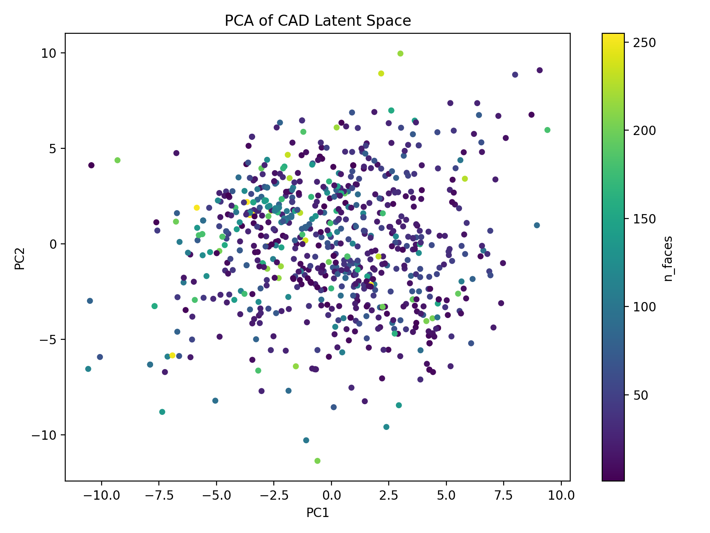
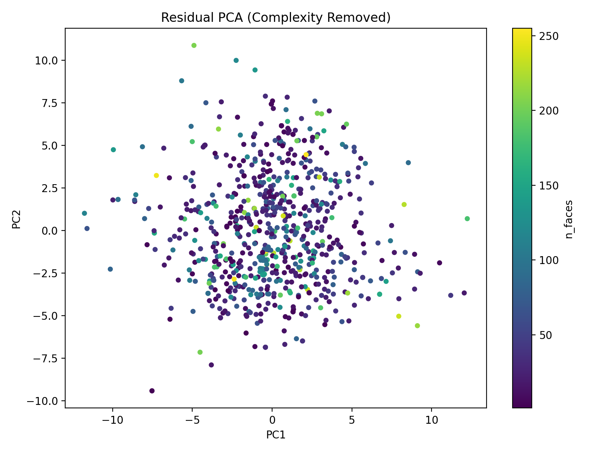
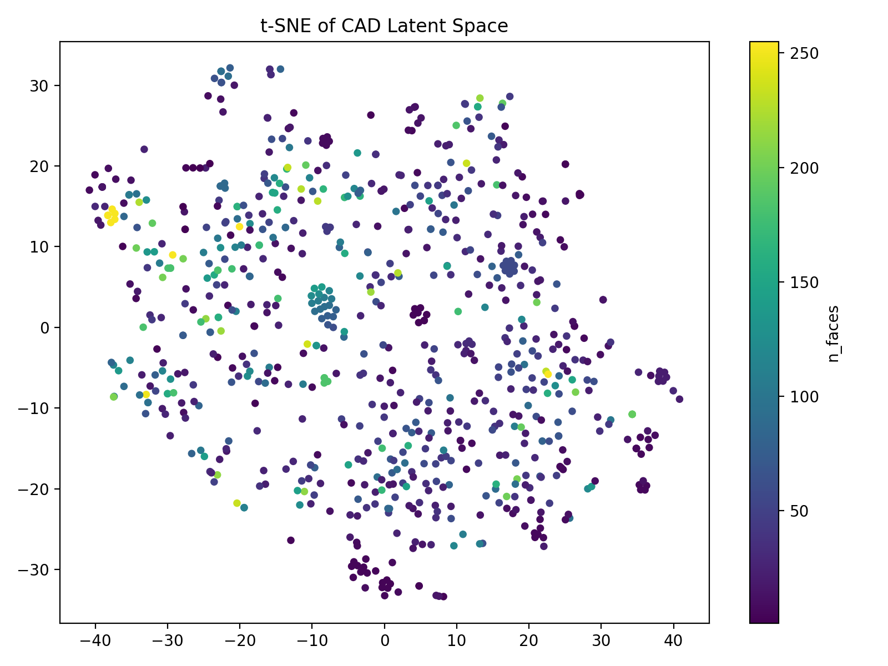

# TopologyAware CAD Encoder

Topology-aware semantic representation learning for STEP/B-Rep CAD models using graph attention networks and hierarchical pooling.


---

## Overview

TopologyAware CAD Encoder learns continuous latent embeddings directly from CAD topology and geometry information.

The framework converts STEP/B-Rep models into graph-based representations and learns semantic CAD embeddings through graph attention mechanisms.

Potential applications include:

* CAD retrieval
* CAD clustering
* Similarity search
* Semantic embedding
* Industrial CAD representation learning
* Foundation models for CAD

---

## Pipeline

```text
STEP CAD Model
      ↓
B-Rep Parsing
      ↓
Face UV Sampling
      ↓
CNN Face Encoder
      ↓
Face Feature Tokens
      ↓
Graph Attention Network
      ↓
Hierarchical Pooling
      ↓
64-D CAD Latent Embedding
```

---

## Architecture

The encoder combines geometric surface sampling and graph neural networks.

### Key Components

* B-Rep topology extraction
* Face UV grid sampling
* CNN-based face feature encoding
* Face adjacency graph construction
* Graph Attention Network (GAT)
* Hierarchical graph pooling
* Latent embedding projection

---

## Dataset

Training and evaluation were conducted using the **ABC Dataset**, a large-scale collection of CAD models represented as STEP/B-Rep geometry.

Reference:

> Koch et al., ABC: A Big CAD Model Dataset For Geometric Deep Learning.

---

## Repository Structure

```text
TopologyAware_CAD_Encoder/
│
├── preprocess/
│   └── step1_preprocess.py
│
├── training/
│   └── step2_train_cad_encoder.py
│
├── export/
│   └── export_zgeo_industrial_v3.py
│
├── examples/
│   ├── pca.png
│   ├── residual_pca.png
│   ├── tsne.png
│   └── evaluation_summary.txt
│
├── requirements.txt
├── LICENSE
└── README.md
```

---

## Installation

Clone the repository:

```bash
git clone https://github.com/yuxinyu-lab/TopologyAware_CAD_Encoder.git

cd TopologyAware_CAD_Encoder
```

Install dependencies:

```bash
pip install -r requirements.txt
```

---

## Training Pipeline

### Step 1: CAD Preprocessing

Convert STEP models into graph representations.

```bash
python preprocess/step1_preprocess.py
```

### Step 2: Encoder Training

Train the topology-aware CAD encoder.

```bash
python training/step2_train_cad_encoder.py
```

### Step 3: Latent Export

Export learned latent embeddings.

```bash
python export/export_zgeo_industrial_v3.py
```

---

## Latent Space Evaluation

The learned latent space was evaluated using:

* PCA
* Residual PCA
* t-SNE
* Complexity correlation analysis

Qualitative visualization suggests:

* Structured latent organization
* Smooth semantic transitions
* Reduced dependence on geometric complexity

---

## Visualization Results

### PCA Projection



### Residual PCA



### t-SNE Visualization



---

## Output

The trained encoder produces fixed-length latent embeddings for CAD models.

These embeddings can be used for:

* Similarity search
* Retrieval systems
* CAD clustering
* Downstream machine learning tasks

---

## Future Work

* Larger-scale industrial CAD datasets
* Self-supervised CAD pretraining
* CAD foundation models
* Generative CAD systems
* Retrieval-augmented CAD design

---

## License

This project is released under the MIT License.

See the LICENSE file for details.

---

## Citation

If you use this project in academic research, please cite:

```bibtex
@software{topologyaware_cad_encoder,
  title={TopologyAware CAD Encoder},
  author={Yuxinyu Lab},
  year={2025},
  url={https://github.com/yuxinyu-lab/TopologyAware_CAD_Encoder}
}
```
